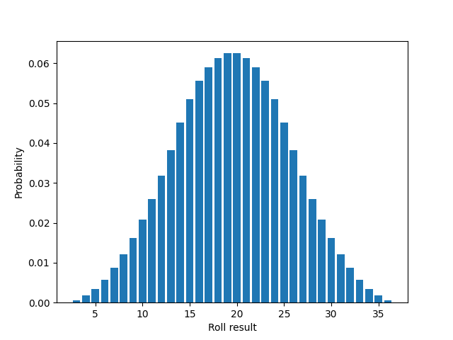

# dice-roll-distribution

For the intersection of table top RPG players and math nerds.
Studies the distribution of results of dice rolls (typically for D&D).

## Sum of dices

When rolling multiple dices and adding the result of each dice.
These rolls are typically called 'XdY', e.g. '1d6' (one 6-sided dice) or '5d4' (five 4-sided dices).

### One dice

When rolling one dice, each result is as likely as any other.
The distribution is said to be **[uniform](https://en.wikipedia.org/wiki/Discrete_uniform_distribution)**.

### Two dices

When rolling two dices, extremes can only occur when both dices rolled their smallest number or when both rolled their biggest number.
Probabilities increase linearly as we get closer to the middle.
This distribution is said to be **[triangular](https://en.wikipedia.org/wiki/Triangular_distribution)**.

#### Explanation

For example, when rolling 2d6, the only way to get a 2 is if both dices rolled 1; the only way to get a 12 is if both dices rolled 6.

Getting a 3 is easier though, as it can be obtained with 2+1 or 1+2. Same goes for 11, with 5+6 or 6+5.

4 and 10 are even more likely, since the lists of scenarios producing them are respectively:
- 1+3, 2+2, 3+1
- 4+6, 5+5, 6+4
  
We can go on like this until we reach the maximum in the middle, 7.

The following table allows to see all the possible scenarios:
| /     |     | 1   | 2   | 3   | 4   | 5   | 6   |
| ----- | --- | --- | --- | --- | --- | --- | --- |
| **1** |     | 2   | 3   | 4   | 5   | 6   | 7   |
| **2** |     | 3   | 4   | 5   | 6   | 7   | 8   |
| **3** |     | 4   | 5   | 6   | 7   | 8   | 9   |
| **4** |     | 5   | 6   | 7   | 8   | 9   | 10  |
| **5** |     | 6   | 7   | 8   | 9   | 10  | 11  |
| **6** |     | 7   | 8   | 9   | 10  | 11  | 12  |

The result of the first dice appear on the top row, the result of the second dice on the leftmost column.
The value in 3-4 corresponds to the result obtained when the first dice rolls 3 and the second one rolls 4: total is 7.

### Three or more dices

With more dices, we start to see a bell curve.
This tends toward a **[normal](https://en.wikipedia.org/wiki/Normal_distribution)**, also called **Gaussian**.

The more dices we roll, the narrower the curve gets. The more sides the dice has, the more precise the bell shape becomes.

#### 3d6

#### 7d6

#### 3d12

#### 7d12

## Best of dices

When rolling multiple dices and selecting the highest result.
Typically how the "advantage" works in D&D: roll two d20s and keep the best outcome.

### Two dices

The distribution is **linear**.

#### Explanation

Let's take two d4s as example and study all possible scenarios.

| /     |     | 1   | 2   | 3   | 4   |
| ----- | --- | --- | --- | --- | --- |
| **1** |     | 1   | 2   | 3   | 4   |
| **2** |     | 2   | 2   | 3   | 4   |
| **3** |     | 3   | 3   | 3   | 4   |
| **4** |     | 4   | 4   | 4   | 4   |

Each outcome has 2 more favorable scenarios than the previous.

### Three or more dices

With more dices, the curve appears to look like a [polynomial](https://en.wikipedia.org/wiki/Polynomial).
Given that it's linear with one dice, I'll guess it's a polynomial of a degree equal to the number of dices minus 1 (between 0 and 1).

If you have any explanation, I'd be curious to hear it.

#### 3d20

#### 6d20

#### Comparison with polynomials

- In green: $f(x) = x^2$ (which looks like 3d20).
- In blue: $f(x) = x^5$ (which looks like 6d20).

